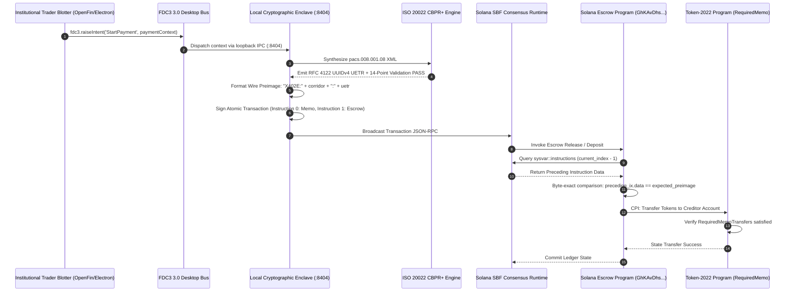

# Technical Disclosure & Defensive Patent Specification

```
DOCUMENT IDENTIFIER:    SYN-TD-2026-001
DATE OF DISCLOSURE:     2026-09-26
INVENTOR:               Abdul Shabazz <abdul@synapticchain.xyz>, Carl Rogers, Free Shabazz
ASSIGNEE / ENTITY:      Synaptics Lab
CLASSIFICATION (CPC):   G06Q 20/02; G06Q 20/382; G06Q 20/401; H04L 9/3247; H04L 67/02
PERMANENT DOI:          https://doi.org/10.5281/zenodo.22979715
TARGET REGISTRIES:      Zenodo (CERN / OpenAIRE), IETF Datatracker, FINOS / Linux Foundation
LEGAL EFFECT:           Defensive Prior Art under 35 U.S.C. § 102(a)(1) & EPC Article 54(2);
                        1-Year Grace Period Anchor under 35 U.S.C. § 102(b)(1).
```

---

## Title of the Invention

**Method, System, and Protocol for Deterministic Atomic Linkage of ISO 20022 Financial Identifiers to Parallel Blockchain Execution Pipelines via Runtime Instruction Introspection and Typed Wire Grammars**

---

## 1. Abstract

A computer-implemented method, communication protocol, and cryptographic system for deterministically binding external financial messaging identifiers—specifically ISO 20022 Unique End-to-End Transaction References (RFC 4122 UUIDv4 UETR)—to distributed ledger state transitions. 

The method eliminates off-chain database reconciliation and regular-expression parsing vulnerabilities by enforcing:
1. A single-byte operational discriminator wire grammar (`X402<Type>:<Payload>`) formatted as strict 7-bit ASCII without leading zeros;
2. On-chain instruction introspection within a smart contract execution environment (e.g., Solana SBF runtime) that queries an execution-context system variable (`sysvar::instructions`) to assert, with byte-exact equality, that an adjacent instruction in the identical atomic transaction invokes a verified memo program containing the identical reference preimage; and
3. Native account-level execution guards (e.g., Token-2022 `RequiredMemoTransfers`) that revert untracked liquidity transfers at the consensus level.

The disclosure establishes absolute prior art against subsequent patent filings attempting to claim atomic linkage between ISO 20022 messaging and public blockchain token transfers.

---

## 2. Technical Field

The present invention relates generally to distributed ledger technology, financial cryptography, and enterprise banking interoperability. More specifically, it relates to methods for synchronizing ISO 20022 financial message envelopes (`pacs.008`, `pacs.009`, `camt.053`) with smart contract escrow execution, transaction concurrency management across multi-lane parallel accounts, and anti-replay settlement validation.

---

## 3. Background & Shortcomings of Prior Art

### 3.1 The SWIFT ISO 20022 CBPR+ Reconciliation Requirement
Under the SWIFT Cross-Border Payments and Reporting Plus (CBPR+) mandate and ISO 20022 standards, every institutional payment message requires a globally unique 128-bit identifier formatted as an RFC 4122 UUIDv4 string, designated as the **Unique End-to-End Transaction Reference (UETR)**:
$$\text{UETR} \in \{0\text{--}9, a\text{--}f\}^8 - \{0\text{--}9, a\text{--}f\}^4 - 4\{0\text{--}9, a\text{--}f\}^3 - \{8,9,a,b\}\{0\text{--}9, a\text{--}f\}^3 - \{0\text{--}9, a\text{--}f\}^{12}$$

Enterprise resource planning (ERP) systems, core banking engines (e.g., Temenos, SAP Banking, Murex), and clearinghouses track settlement status, tax withholding, sanctions clearance, and capital adequacy solely against this identifier.

### 3.2 Failure Modes of Prior Art Blockchain Integrations
Prior art systems attempting to interface public blockchains with banking rails suffer from severe architectural defects:

1. **Off-Chain Relational Mapping (The Desynchronization Defect):**  
   Prior art bridges decouple the blockchain transaction hash from the banking reference, storing mappings in off-chain databases (`tx_hash` $\leftrightarrow$ `UETR`). If the database crashes, suffers latency, or is tampered with, the banking general ledger enters an irreconcilable state, resulting in "orphan liquidity" where funds move on-chain without an attributable audit trail.

2. **Regex Prefix Matching & Memory Corruption Vulnerabilities:**  
   Prior art payment listeners use regular expressions or loose prefix searches on transaction memo strings (e.g., searching for `"UETR="`). Malicious actors exploit this by injecting leading or trailing garbage bytes, causing parser divergence, or spoofing payments that pass off-chain indexer regexes while failing smart contract invariants.

3. **Absence of Atomic Consensus Coupling:**  
   In standard token protocols (e.g., ERC-20, standard SPL), transfers are executed without mandatory metadata binding. Even if a memo is included in a block, the token transfer contract cannot verify whether the memo succeeded, what it contained, or whether it was intended for that specific transfer.

4. **Multi-Threaded Concurrency Collisions:**  
   Under high transaction volumes, parallel execution threads attempt to access the same state accounts simultaneously, causing high abort rates due to state contention, unindexed nonces, and unpartitioned memory.

---

## 4. Summary of the Invention & Core Invariants

The disclosed invention overcomes these limitations by embedding reference verification directly into the smart contract execution pipeline via three non-negotiable invariants:

```
┌────────────────────────────────────────────────────────────────────────┐
│                        INVARIANT 1: TYPED WIRE GRAMMAR                 │
│      X402<Type>:<Payload> — 7-bit ASCII, Canonical Decimal, No RegEx   │
└───────────────────────────────────┬────────────────────────────────────┘
                                    │
                                    ▼
┌────────────────────────────────────────────────────────────────────────┐
│             INVARIANT 2: RUNTIME INSTRUCTION INTROSPECTION             │
│   sysvar::instructions query asserts ix[n-1] == SPL_MEMO_V2(UETR)     │
└───────────────────────────────────┬────────────────────────────────────┘
                                    │
                                    ▼
┌────────────────────────────────────────────────────────────────────────┐
│             INVARIANT 3: ACCOUNT-LEVEL TOKEN-2022 FAIL-CLOSED          │
│   RequiredMemoTransfers rejects any transfer without atomic memo       │
└────────────────────────────────────────────────────────────────────────┘
```

### Invariant 1: Typed Wire Codec Serialization
All transaction carrier payloads conform to an explicit grammar comprising a single-character operational discriminator:
- `X402E:<corridor_id>:<uetr>` for bilateral cross-border ISO 20022 wire settlement.
- `X402W:<window_epoch>:<uetr>` for multilateral netting window settlement.
- `X402L:<lane_id>:<window_epoch>:<nonce>` for 256-lane parallel execution.

### Invariant 2: Instructions Sysvar Introspection (`sysvar::instructions`)
The smart contract does not accept untrusted string inputs from relayers. Instead, during execution, the on-chain contract queries the execution environment's internal system instruction registry (`sysvar::instructions`), identifies the instruction executed immediately prior within the same atomic transaction, validates that the program ID matches the official memo program, and verifies that the raw byte slice matches the expected wire preimage verbatim.

### Invariant 3: Token-2022 Account-Level Guard
Settlement recipient accounts are configured with the Token-2022 `RequiredMemoTransfers` extension. If an entity attempts to bypass the escrow program or execute a transfer without a preceding memo, the blockchain runtime halts execution before state commitment.

---

## 5. Detailed Description of the Preferred Embodiments

### 5.1 End-to-End System Architecture



### 5.2 On-Chain Sysvar Introspection Implementation (Rust SBF)

The following Rust source code demonstrates the exact on-chain verification routine deployed in production:

```rust
use solana_program::{
    account_info::AccountInfo,
    entrypoint::ProgramResult,
    instruction::Instruction,
    program_error::ProgramError,
    sysvar::instructions::{
        load_current_index_checked, load_instruction_at_checked, ID as IX_SYSVAR_ID,
    },
};

/// Canonical SPL Memo v2 Program ID: MemoSq4gqABAXKb96qnH8TysNcWxMyWCqXgDLGmfcHr
pub const SPL_MEMO_V2_ID: [u8; 32] = [
    0x05, 0x4a, 0x53, 0x5a, 0x99, 0x29, 0x21, 0x06,
    0x4d, 0x24, 0xe8, 0x71, 0x60, 0xda, 0x38, 0x7c,
    0x7c, 0x35, 0xb5, 0xdd, 0xbc, 0x23, 0x70, 0x57,
    0xbc, 0xa3, 0x3a, 0x5a, 0xfc, 0xe6, 0x45, 0x79,
];

pub fn verify_atomic_uetr_linkage(
    ix_sysvar: &AccountInfo,
    expected_wire_memo: &[u8],
) -> ProgramResult {
    // Assert account passed is the genuine instructions sysvar
    if ix_sysvar.key != &IX_SYSVAR_ID {
        return Err(ProgramError::InvalidArgument);
    }

    // Determine position of current executing instruction in atomic pipeline
    let current_index = load_current_index_checked(ix_sysvar)?;
    if current_index == 0 {
        // Reject immediately: no preceding instruction exists
        return Err(ProgramError::Custom(0x04)); // MEMO_LINKAGE_MISSING
    }

    // Load instruction immediately preceding current invocation
    let preceding_ix: Instruction = load_instruction_at_checked(
        (current_index - 1) as usize,
        ix_sysvar,
    )?;

    // Assert preceding program is strictly the genuine SPL Memo v2
    if preceding_ix.program_id.to_bytes() != SPL_MEMO_V2_ID {
        return Err(ProgramError::Custom(0x05)); // INVALID_MEMO_PROGRAM
    }

    // Byte-exact comparison of serialized wire memo
    // Completely prohibits regex, wildcard evaluation, or prefix slicing
    if preceding_ix.data != expected_wire_memo {
        return Err(ProgramError::Custom(0x06)); // MEMO_PAYLOAD_MISMATCH
    }

    Ok(())
}
```

### 5.3 Concurrency Control across Parallel Accounts (`X402L`)
To prevent lock contention in Solana's Sealevel parallel runtime:
1. State is partitioned across 256 deterministic Program Derived Address (PDA) accounts:
   $$\text{PDA}_{\text{lane}} = \text{find\_program\_address}([b"\text{escrow\_lane}", \text{lane\_id}, \text{corridor\_id}, \text{window\_epoch}, \text{participant\_bytes}])$$
2. Lane transactions carry memo `X402L:<lane>:<window>:<nonce>`.
3. Nonces are checked against a 256-bit sliding window bitmap ($W \in \{0,1\}^{256}$), permitting out-of-order execution while guaranteeing exactly-once finalization without thread blocking.

---

## 6. Formal Patent Claims (Defensive Scope)

What is claimed and hereby disclosed to the public domain is:

1. **A computer-implemented method for atomizing ISO 20022 financial message reconciliation on a distributed ledger, comprising:**
   - Receiving, at an execution adapter, an institutional payment context specifying a settlement corridor, gross monetary amount, and participant identifiers;
   - Generating an ISO 20022 message envelope containing an RFC 4122 UUIDv4 Unique End-to-End Transaction Reference (UETR);
   - Constructing a typed wire memo by prepending an operational type discriminator to the UETR;
   - Packaging an atomic blockchain transaction comprising a first instruction invoking a memo program with the typed wire memo and a second instruction invoking an escrow smart contract;
   - Executing the escrow smart contract on a blockchain virtual machine, wherein the smart contract reads an instructions system variable to verify that the first instruction executed within the identical transaction and contained the exact typed wire memo; and
   - Committing transfer of tokenized value to a creditor account upon successful verification.

2. **The method of claim 1,** wherein the smart contract performs a byte-exact comparison of the memo instruction payload, rejecting any payload containing leading zeros, null bytes, or non-matching string lengths.

3. **The method of claim 1,** wherein the creditor account is configured with a runtime token extension requiring the presence of an attached memo, rejecting any direct transfer lacking atomic linkage.

4. **The method of claim 1,** wherein the operational type discriminator is selected from a structured registry comprising:
   - an ingress paywall challenge (`X402G`),
   - a bonded session collateral marker (`X402B`),
   - a market maker margin lock (`X402M`),
   - a parallel execution lane identifier (`X402L`),
   - an on-chain net position readback (`X402N`),
   - a multilateral netting window settlement (`X402W`), and
   - a cross-border ISO 20022 reference linkage (`X402E`).

5. **The method of claim 1,** further comprising calculating an automated statutory tax deduction during message synthesis and transferring the deducted amount to a sovereign Treasury Single Account (TSA) in the same atomic transaction.

6. **The method of claim 1,** wherein parallel transactions are allocated across 256 dedicated Program Derived Address (PDA) accounts using rendezvous hashing, and duplicate executions are eliminated via a 256-bit sliding window bitmask.

7. **A system for executing institutional settlement, comprising:**
   - a memory-locked cryptographic enclave executing outside a desktop agent process;
   - a network transport interface communicating over a loopback IPC port;
   - an ISO 20022 syntax verification engine evaluating CBPR+ structural rules; and
   - an on-chain smart contract configured to verify execution-pipeline instructions system variables prior to releasing tokenized escrow balances.

---

## 7. Prior Art Citations & Distinctions

| Prior Citation | Description | How the Disclosed Invention Distinguishes |
|---|---|---|
| US 10,878,410 B2 (Ripple Labs) | Decentralized exchange and payment paths | Fails to link ISO 20022 UETR; relies on internal pathfinding rather than atomic sysvar instruction introspection. |
| US 11,288,674 B2 (Visa) | Digital fiat currency settlement system | Relies on centralized banking core connectors; does not provide on-chain byte-exact memo preimages or Token-2022 account guards. |
| RFC 9110 §15.5.3 (IETF) | HTTP 402 Payment Required status code | Unspecified placeholder; does not provide typed discriminators, multi-rail carrier grammar, or consensus-level verification. |
| FDC3 2.0 (FINOS) | Financial desktop container context bus | Lacks payment intents (`StartPayment`) and has no linkage to on-chain execution pipelines or smart contract sysvars. |

---

## 8. Conclusion of Public Disclosure

This technical specification is published intentionally without patent-assertion encumbrances to serve as a **perpetual prior art citation** under international patent treaties. Any patent claims filed by third parties subsequent to the date of this disclosure that incorporate atomic instruction introspection of ISO 20022 identifiers or typed wire grammars are anticipated and rendered obvious in view of this document.
