# STRATEGIC EXECUTION ROADMAP: THE 4 DEFENSIVE IP PILLARS (2026 – 2027)

**Document Reference:** `SYN-ROADMAP-4P-2026-09`  
**Classification:** Institutional Product Strategy & Patent Commercialization  
**Defensive Prior Art Base:** CERN Zenodo DOIs `10.5281/zenodo.23000701`, `10.5281/zenodo.23002617`, `10.5281/zenodo.23002720`, `10.5281/zenodo.23002771`  
**Target Venues:** Solana Colosseum Radar, Linux Foundation / FINOS, Institutional Capital Markets  

---

## Executive Vision: Commercializing the $5 Trillion Disruption

Traditional correspondent banking relies on disjointed bilateral messaging (SWIFT) coupled with pre-funded Nostro/Vostro accounts that trap **$5 Trillion in dormant capital** across multi-day ($T+2$) settlement cycles. 

Our four newly registered patent specifications convert this theoretical breakthrough into an institutional-grade, commercial reality:

```mermaid
flowchart LR
    subgraph Track1 [Track 1: Master L1 Umbrella]
        direction TB
        T1_DOI["DOI: 10.5281/zenodo.23000701"]
        T1_Tech["Stateless Edge-Settlement<br>& SCBFT Consensus"]
    end

    subgraph Track2 [Track 2: Continuous Atomic Netting]
        direction TB
        T2_DOI["DOI: 10.5281/zenodo.23002617"]
        T2_Tech["CAN Engine & 382ms<br>Sealevel PTB Pipelining"]
    end

    subgraph Track3 [Track 3: Zero-Knowledge Privacy]
        direction TB
        T3_DOI["DOI: 10.5281/zenodo.23002720"]
        T3_Tech["Token-2022 ZK Transfers<br>& NIST AU-2 Compliance"]
    end

    subgraph Track4 [Track 4: Hardware Enclaves]
        direction TB
        T4_DOI["DOI: 10.5281/zenodo.23002771"]
        T4_Tech["ADR-555 Apple SEP<br>& AWS Nitro TPM Attestation"]
    end

    Track1 ==> Track2
    Track2 ==> Track3
    Track3 ==> Track4
```



---

## Track-by-Track Execution Plan

### Track 1: Master Stateless Edge-Settlement L1 Architecture
* **Patent Anchor:** `DOI 10.5281/zenodo.23000701` (`SYN-TD-2026-006`)
* **Core Technological Claim:** A Layer-1 distributed ledger technology optimized for stateless edge-settlement that pushes heavy compliance and application logic off-chain to non-pageable enclaves, relegating the blockchain VM to a rigid, deterministic state-transition verification engine.
* **Milestones:**
  * **Q4 2026 (Live Baseline):** Sovereign Consensus Byzantine Fault Tolerant (SCBFT) 256-lane partition allocation via rendezvous hashing running on testnet nodes.
  * **Q1 2027:** Formally release the `synaptic-node` v2 binary with native Application-Layer Protocol Negotiation (ALPN) for `x402` and `tswp` per IETF/RFC 7301 specifications.
  * **Q2 2027:** Implement parallel execution scheduler integration across NUMA nodes, achieving verified 15,000+ native settlement TPS on multi-core validator hardware.

---

### Track 2: Continuous Atomic Netting (CAN) Engine
* **Patent Anchor:** `DOI 10.5281/zenodo.23002617` (`SYN-TD-2026-007`)
* **Core Technological Claim:** Eliminates discontinuous 24-hour Continuous Linked Settlement (CLS) batch windows by chaining bilateral and multilateral foreign exchange obligations into atomic Programmable Transaction Blocks (PTBs) that clear in $\le 400\text{ms}$ on Solana Sealevel.
* **Milestones:**
  * **Q4 2026 (Live Baseline):** Live 382ms DvP execution on Solana Devnet between `traderx.synapticchain.xyz` and `terminal.synapticchain.xyz`, enforcing `RequiredMemoTransfers` and Mantis Invariant 9 ($\Delta \equiv 0$).
  * **Q1 2027:** Roll out multi-currency rolling epoch windows ($W_{k}$) supporting cross-currency netting (USD/KES, USD/TZS, EUR/USD) with crash-safe fee cursors.
  * **Q2 2027:** Deploy the production `MultilateralNettingClearinghouse` contract across the East African Cross-Border Corridor, demonstrating automated balance settlement without pre-funded Nostro accounts.

---

### Track 3: Zero-Knowledge ISO 20022 Confidential Clearing
* **Patent Anchor:** `DOI 10.5281/zenodo.23002720` (`SYN-TD-2026-008`)
* **Core Technological Claim:** Resolves the institutional trilemma between public blockchain consensus, banking balance sheet secrecy, and regulatory auditability. Uses twisted ElGamal encryption and Pedersen commitments over the Ristretto255 curve, coupled with delegated auditor viewing keys satisfying NIST SP 800-53 Rev 5 control AU-2.
* **Milestones:**
  * **Q1 2027:** Integrate Solana Token-2022 `ConfidentialTransfer` extensions directly into the BankerX settlement blotter.
  * **Q2 2027:** Implement the delegated viewing key protocol inside the ADR-555 Enclave, enabling selective unshielding of ISO 20022 `pacs.008` XML audit records exclusively to designated central bank/regulatory nodes.
  * **Q3 2027:** Complete institutional red-team privacy audit proving zero balance leakage to public MEV searchers and competing market makers.

---

### Track 4: Hardware-Attested Pre-Flight Enclaves (ADR-555)
* **Patent Anchor:** `DOI 10.5281/zenodo.23002771` (`SYN-TD-2026-009`)
* **Core Technological Claim:** Hardware-rooted execution binding transaction signing directly to Apple Silicon Secure Enclave Processors (SEP) and AWS Nitro Enclaves (TPM 2.0). Ensures private keys cannot be dumped from host RAM, and mandates SIMD Bloom filter sanctions checks and Invariant 9 proofs before cryptographic signatures can be generated.
* **Milestones:**
  * **Q4 2026 (Live Baseline):** In-memory 65,536-bit SIMD Bloom filter screening (<1.0ms, zero network leakage) and WOTS+ 67-chain post-quantum attestation verified in production.
  * **Q1 2027:** Deliver the native macOS desktop companion app leveraging Apple CryptoKit and Secure Enclave hardware keys (`kSecAttrAccessibleAfterFirstUnlockThisDeviceOnly`).
  * **Q2 2027:** Publish AWS Nitro Enclave attestation AMI for enterprise bank cloud deployments, mapping to FINOS Common Cloud Controls (CCC) Issue #1227.

---

## 4-Quarter Institutional Commercialization Matrix

```
┌────────────────────────────────────────────────────────────────────────────────────────┐
│                        4-QUARTER COMMERCIALIZATION TIMELINE                            │
├────────────┬─────────────────────────────┬─────────────────────────────────────────────┤
│ Quarter    │ Technical Deliverable       │ Institutional / Regulatory Milestone        │
├────────────┼─────────────────────────────┼─────────────────────────────────────────────┤
│ Q4 2026    │ • 9-DOI Patent Portfolio    │ • Colosseum Solana Radar Submission         │
│ (Current)  │ • Live TraderX ↔ BankerX    │ • FINOS TraderX PR #470 & CCC Issue #1227   │
│            │ • Sub-400ms Token-2022 PTB  │ • FDC3 3.0 Experimental Spec Alignment      │
├────────────┼─────────────────────────────┼─────────────────────────────────────────────┤
│ Q1 2027    │ • Apple SEP / Nitro TPM     │ • FINOS Open Source in Finance London Pilot │
│            │ • Multi-Currency Netting    │ • Central Bank of Kenya / BoT Sandbox App   │
│            │ • Token-2022 ZK Encryption  │ • Initial Institutional Liquidity Onboarding│
├────────────┼─────────────────────────────┼─────────────────────────────────────────────┤
│ Q2 2027    │ • Autonomous JIT Nostro     │ • OpenEAGO AI Agent Settlement Reference L1 │
│            │ • Delegated AU-2 Viewing Key│ • Tier-2 Regional Bank Clearing Pilot       │
│            │ • 15,000+ Multi-Lane TPS    │ • SOC 2 Type II & ISO 27001 Certification   │
├────────────┼─────────────────────────────┼─────────────────────────────────────────────┤
│ Q3 2027    │ • Full Production L1 Mesh   │ • Full Production Commercial Clearinghouse  │
│            │ • Cross-Chain Settlement Bus│ • $100M+ Monthly Netting Volume             │
│            │ • Post-Quantum WOTS+ Mainnet│ • Series A Institutional Venture Round      │
└────────────┴─────────────────────────────┴─────────────────────────────────────────────┘
```

---

## Strategic Significance for Colosseum Judges and VCs

1. **Defensible Technology Moat:** Competitors cannot copy our architecture without infringing on 9 timestamped CERN Zenodo prior art disclosures under 35 U.S.C. § 102.
2. **Clear Path to Production Revenue:** This is not a speculative retail meme or governance token; it is a direct operational cost-reduction engine for cross-border banking corridors.
3. **Regulatory Native:** Compliance is not an afterthought; it is mathematically enforced at Gate 3 before any transaction touches the wire.
