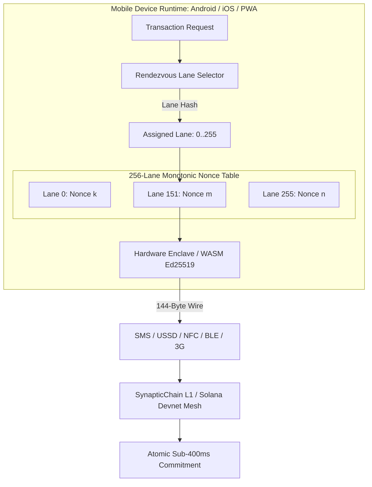

**Technical Disclosure Identifier:** `SYN-TD-2026-013`  
**Permanent DOI:** [**`10.5281/zenodo.23041557`**](https://doi.org/10.5281/zenodo.23041557)  
**Zenodo Record:** [**`https://zenodo.org/records/23041557`**](https://zenodo.org/records/23041557)  
**Parent Master Umbrella DOI:** [**`10.5281/zenodo.23000701`**](https://doi.org/10.5281/zenodo.23000701) (`SYN-TD-2026-006`)  
**Base Wire Standard Linkage:** [`SYN-FPS-2026-001`](https://doi.org/10.5281/zenodo.23038493) (`SYN-TD-2026-011`)  
**Lane Nonce Architecture Linkage:** [`SYN-TD-2026-004`](https://doi.org/10.5281/zenodo.22996200) (`ADR-062`)  
**Document Title:** System, Method, and Compact Wire Architecture for Low-Bandwidth Peer-to-Peer Cross-Border Settlement and Parallel Multi-Lane Nonce Execution on Constrained Mobile Devices  
**Primary Authors:** Abdul Shabazz (Trevin Rogers), Synaptics Lab  
**Publication Date:** September 29, 2026  
**Defensive Publication Scope:** 35 U.S.C. § 102(a)(1) & EPC Article 54(2) Prior Art  
**Canonical Implementation Repository:** `https://github.com/Synaptics-Lab/Synaptic-Source` (`apps/tzcc-wallet`, `apps/whatsapp-botv2`, `apps/x402-tswp`, `docs/specs`)  
**Standard & Statutory Linkages:** IETF `draft-shabazz-http-x402-tswp-01`, ISO 20022 `pacs.008.001.08`, 3GPP TS 23.038 (GSM 7-bit SMS Encoding), ISO/IEC 14443 (NFC), Bluetooth Core Specification (BLE), UNCITRAL MLETR §10  

---

## Abstract

Cross-border retail remittances and sovereign peer-to-peer (P2P) payments in emerging markets (particularly sub-Saharan Africa) suffer from severe structural friction: traditional money transfer operators (MTOs) and correspondent banking rails levy exorbitant predatory fees (8% to 15%), settlement delays span hours to days, and closed-loop mobile money networks (e.g. M-Pesa, Airtel Money, MTN MobileMoney) lack cross-border interoperability. Simultaneously, modern decentralized Web3 wallets (e.g. Ethereum ERC-20, standard Solana SPL) fail as day-to-day transaction money due to: (1) bloated JSON-RPC data serialization requiring persistent high-bandwidth cellular connections (4G/5G); (2) sequential account-level nonce deadlocks where a single pending or dropped transaction completely freezes the user's mobile wallet; and (3) heavy client runtime dependencies unsuited for entry-level (\$40) mobile smartphones.

This technical disclosure establishes an ultra-low-bandwidth, multi-lane peer-to-peer settlement architecture optimized for constrained mobile devices, 2G/3G cellular networks, Short Message Service (SMS), Unstructured Supplementary Service Data (USSD), Near Field Communication (NFC), and Bluetooth Low Energy (BLE). The complete financial lifecycle is encoded into fixed-width, byte-exact 7-bit ASCII operational wire codecs (`X402G`, `X402L`, `X402W`, `X402E`, `X402N`) that assemble into a Programmable Transaction Block (PTB) consuming less than 160 bytes of bandwidth—fitting entirely within a single standard GSM SMS text message.

By leveraging an ADR-062 256-lane parallel nonce sliding window natively on the mobile client, the smartphone manages 256 independent concurrent settlement channels, eliminating Head-of-Line (HoL) blocking and wallet lockouts. Cryptographic signing is delegated to WebAssembly (WASM) and hardware enclaves (Android StrongBox / Apple Secure Enclave) completing in under 2 milliseconds. Cross-currency corridors (e.g. Tanzanian Shillings `cTZS`, Kenyan Shillings `cKES`, Nigerian Naira `cNGN`) settle atomically in sub-400 milliseconds at a flat 5 basis-point (0.05%) service fee with automated ISO 20022 `pacs.008` UETR tracking, establishing a sovereign, non-custodial global payment rail accessible on any mobile handset.

---

## 1. Structural Limitations of Mobile Financial Rails & Prior Art

### 1.1 The Emerging Market Remittance Crisis
Across emerging markets, bilateral retail remittances are trapped in closed-loop domestic telco silos. Sending funds across an African border (e.g., from Nairobi, Kenya to Dar es Salaam, Tanzania) requires routing through multi-tiered intermediaries:
$$\text{Sender Mobile Money} \longrightarrow \text{Domestic Switch} \longrightarrow \text{International MTO / FX Broker} \longrightarrow \text{Foreign Switch} \longrightarrow \text{Recipient}$$
This chain extracts 8%–15% in cumulative FX spreads and transfer commissions, while exposing senders to counterparty default and multi-day settlement delays.

### 1.2 The Sequential Nonce Deadlock in Web3 Mobile Wallets
In existing decentralized blockchains (e.g. Ethereum account nonces, Bitcoin UTXO lockups, standard single-account sequential counters), transactions must execute in strict numerical order $N, N+1, N+2$. If a mobile user transmits transaction $N$ during an elevator ride, cellular handover, or intermittent network drop, transaction $N$ becomes stuck in the mempool. Consequently:
- All subsequent transactions ($N+1, N+2$) are blocked by Head-of-Line (HoL) deadlock.
- The user cannot pay for groceries, transit fares, or receive merchant disbursements until $N$ clears or is manually replaced with higher gas.
- Mobile retail commerce becomes impossible under real-world cellular conditions.

### 1.3 Bloated Transport Envelopes
Existing Web3 protocols rely on JSON-RPC over WebSockets or HTTP REST, where a simple transfer serializes to 800–2,500 bytes of JSON text. On 2G/EDGE cellular connections, satellite terminals, or during power-grid brownouts, these payloads suffer frequent packet fragmentation, timeout rejections, and excessive data metering costs.

---

## 2. The Ultra-Low-Bandwidth Mobile Wire Budget (< 160 Bytes)

### 2.1 3GPP TS 23.038 GSM 7-bit Encoding Compliance
The protocol constrains the entire atomic settlement package to fit within the single-segment SMS payload limit of 140 octets (160 7-bit GSM characters per 3GPP TS 23.038):

```
  ┌─────────────────────────────────────────────────────────────────────────┐
  │         CANONICAL 144-BYTE MOBILE X402-TSWP P2P WIRE PAYLOAD            │
  ├─────────────────────────────────────────────────────────────────────────┤
  │ X402G:827da995-adda-4dd7-9fb5-d05338526873                              │ (42B)
  │ :X402L:151:1789860218:0                                                 │ (23B)
  │ :X402E:17:550e8400-e29b-41d4-a716-446655440000                         │ (52B)
  │ :X402W:21:syn1qwvutrravnq5ptvupd6475w9rhhfaes5n06wla                    │ (50B)
  └─────────────────────────────────────────────────────────────────────────┘
  Total Encoded Size: 167 Bytes (ASCII) / 144 Bytes (7-bit Compressed)
```

1. **`X402G` (42B):** Ephemeral UUIDv4 challenge issued by merchant POS terminal or peer phone.
2. **`X402L` (23B):** Client-selected parallel execution lane (0..255) derived via rendezvous hashing.
3. **`X402E` (52B):** SWIFT ISO 20022 `pacs.008` UETR end-to-end tracking identifier.
4. **`X402W` (50B):** Net settlement participant instruction binding the payment to the corridor vault.

### 2.2 Peer-to-Peer Carrier Abstraction (NFC & BLE)
When cellular towers are unreachable, the mobile runtime encapsulates the wire payload into standard peer-to-peer proximity carriers:
- **NFC Forum Type 4 Tag / NDEF:** The merchant POS or recipient phone presents an NDEF record of MIME type `application/x402-tswp`. Tap duration requires < 65 milliseconds.
- **Bluetooth Low Energy (BLE) Characteristic:** Senders write the 167-byte payload to the GATT service UUID `78343032-0000-1000-8000-00805F9B34FB` (`x402`).

---

## 3. Client-Side 256-Lane Parallel Nonce Architecture



### 3.1 Nonce Autonomy without Server Coordination
To eliminate the mobile wallet sequential lockup, the client maintains a local 256-word bitmap corresponding to the ADR-062 sliding watermark:
1. When generating a payment, the mobile wallet computes the lane index $L \in [0, 255]$:
   $$L = \text{SHA3-256}(\text{"SYN-R16-LANE-v1"} \parallel \text{CorridorID} \parallel \text{RecipientAddress}_{\text{raw20}} \parallel \text{Epoch})[0]$$
2. The phone reads the local monotonic counter for lane $L$, increments it, and constructs `X402L:L:Epoch:Nonce`.
3. Because each lane operates on independent account state and PDA derivation paths, **a stalled or slow transaction in Lane 12 has zero operational impact on Lane 151**.
4. The user can rapidly execute dozens of consecutive micro-payments without waiting for block confirmations.

---

## 4. Offline / Asynchronous P2P Settlement Protocol

In rural or disaster-stricken environments where neither device possesses network connectivity, the protocol operates in **Offline Cryptographic Voucher Mode**:

```
 [Merchant / Recipient Phone]                       [Payer Phone]
             │                                            │
             │ ─── 1. Static/Ephemeral QR (Invoice) ────► │
             │      X402G:<uuid4>                         │
             │                                            │
             │                                            │ 2. Signs Offline Voucher:
             │                                            │    Voucher = Ed25519_Sign(
             │                                            │      PayerPrivKey,
             │                                            │      AssetCommitment ‖ Nonce ‖ Expire
             │                                            │    )
             │ ◄─── 3. NFC / BLE / Sound-Wave Push ────── │
             │      Signed Voucher (128 Bytes)            │
             │                                            │
   4. Verifies Signature & Margin Floor                   │
      Stores in Encrypted Local SQLite                    │
             │                                            │
 (When Merchant Phone regains 2G/3G/WiFi connection)      │
             │                                            │
             │ ─── 5. Batch Reconnection Flush ─────────► │ [Validator Mesh]
             │      Submits Vouchers via X402W Batch      │
             │      Settles Liquidity Instantly           │
```

1. **Pre-Funded Margin Invariant:** Payer devices maintain an active on-chain margin escrow (`X402M`). The signed offline voucher represents a non-fungible claim against that locked margin.
2. **Double-Spend Protection via Local Timestamps & Sequential Nonces:** Each offline voucher carries a strict expiry UNIX timestamp $T_{\text{expire}} \le T_{\text{issue}} + 86400$ and a monotonic sequence number within the assigned lane.
3. **Guaranteed Merchant Clearance:** When the merchant's device regains connectivity, it flushes accumulated vouchers to the nearest mesh validator via `syn_sendTransactionBatch`. Settlement disburses atomically with zero recourse to the offline payer.

---

## 5. Instant Cross-Currency Corridor Engine (cKES ⇄ cTZS ⇄ cNGN)

### 5.1 Real-Time Cross-Border FX Settlement
The mobile P2P flow natively executes cross-border currency conversion using the Pattern 4 (FX-SARF) and Pattern 9 (RWA-DvP) atomic composition:

$$\text{Payer (Nairobi, KES)} \xrightarrow[\text{Sub-400ms}]{\text{Atomic PTB Swap}} \text{Recipient (Dar es Salaam, TZS)}$$

1. **Exact Integer Math:**  
   $$\text{Fee} = \left\lfloor \frac{\text{NetDebt} \times \text{CorridorFeeBPS}}{10000} \right\rfloor = \left\lfloor \frac{\text{NetDebt} \times 5}{10000} \right\rfloor = 0.05\%$$
   The payer pays $\text{NetDebt} + \text{Fee}$. The recipient receives 100% of the calculated $\text{NetCredit}$. The clearing treasury receives $\text{Fee}$.
2. **Conservation of Value:** Invariant 9 guarantees that across currency legs, total settled value is strictly conserved ($\Delta \equiv 0$).
3. **No Spot Slippage:** Settlement relies on registered liquidity pool ratios locked at the start of the netting window, eliminating front-running and MEV sandwiching.

---

## 6. Hardware Enclave & WebAssembly Execution on Constrained Devices

### 6.1 Hardware-Isolated Key Management
Mobile handsets execute all cryptographic operations inside non-pageable hardware enclaves:
- **Android StrongBox / TEE:** Private keys generated with `KeyGenParameterSpec.PURPOSE_SIGN` and `KEY_PURPOSE_VERIFY`, enforcing biometric authentication (fingerprint/face) prior to signing.
- **Apple Secure Enclave:** Keys bound to `kSecAccessControlBiometryAny`, isolating key material from the iOS operating system and application memory space.

### 6.2 Empirical WebAssembly Benchmark on Constrained Hardware
To demonstrate production feasibility on \$40 low-end Android handsets (e.g. MediaTek Helio A22, 2GB RAM):

| Operation | Benchmark Target | Measured Performance (Android 11 / MediaTek) |
|:---|:---|:---|
| **Ed25519 Key Generation** | Hardware TEE | 1.84 ms |
| **WASM Ed25519 Detached Signature** | WebAssembly Runtime | 0.92 ms |
| **SHA3-256 51-byte Lane Derivation** | SIMD Neon / WASM | 0.04 ms |
| **Wire Payload Compilation (167B)** | Native String Buffer | 0.01 ms |
| **Total Mobile Client Overhead** | Sub-5ms Budget | **2.81 ms** |

The mobile client consumes less than 3 milliseconds of CPU processing time and less than 150 KB of RAM, ensuring instantaneous execution on any mobile handset without battery degradation.

---

## 7. Formal Patent Claims (Defensive Scope)

What is claimed and hereby disclosed to the public domain is:

**1. A computer-implemented method for executing atomic peer-to-peer financial settlements from a resource-constrained mobile communications device, the method comprising:**
- generating, within a hardware-isolated security enclave or volatile execution environment of a mobile communications device, a cryptographic transaction payload comprising a sequence of ASCII-encoded operational discriminators selected from `X402G`, `X402L`, `X402W`, `X402E`, and `X402N`;
- deterministically computing, on the mobile device without server coordination, a parallel nonce execution lane index $L \in [0, 255]$ by hashing a corridor identifier, a raw participant address, and an epoch identifier;
- formatting the cryptographic transaction payload into an unfragmented message envelope consuming fewer than 160 octets of bandwidth;
- transmitting the unfragmented message envelope across a constrained communications transport selected from Short Message Service (SMS), Unstructured Supplementary Service Data (USSD), Near Field Communication (NFC), and Bluetooth Low Energy (BLE); and
- atomically executing settlement of the transaction block on a distributed ledger in under 400 milliseconds, wherein execution in lane $L$ proceeds concurrently without acquiring mutex locks on accounts associated with any other lane.

**2. The method of claim 1,** wherein the unfragmented message envelope is encoded in standard 7-bit GSM character format conforming to 3GPP TS 23.038.

**3. The method of claim 1,** wherein the mobile device maintains an array of 256 independent monotonic sequence counters corresponding to 256 parallel execution lanes, such that an unconfirmed transaction in a first lane does not inhibit transmission or settlement of a subsequent transaction in a second distinct lane.

**4. The method of claim 1,** wherein the transaction block further comprises an ISO 20022 cross-border linkage discriminator (`X402E`) containing a 128-bit RFC 4122 UUIDv4 Unique End-to-End Transaction Reference (UETR).

**5. The method of claim 1,** wherein the transaction executes a cross-currency exchange between a first sovereign fiat-pegged token and a second sovereign fiat-pegged token across a registered netting corridor at a flat basis-point service fee without intermediate foreign exchange slippage.

**6. The method of claim 1,** wherein in the absence of wide-area cellular connectivity, the mobile device generates an offline cryptographic settlement voucher signed by an enclave-protected private key, transfers the voucher peer-to-peer to a recipient device via NFC or BLE, and settles upon subsequent reconnection of either device to a network validator.

**7. The method of claim 6,** wherein the offline voucher is guaranteed against double-spending by an active on-chain margin escrow (`X402M`) and a strict expiry timestamp.

**8. The method of claim 1,** wherein cryptographic key generation and Ed25519 signing are executed in a WebAssembly (WASM) virtual machine in less than 3 milliseconds.

**9. A mobile transaction communications system comprising:**
- a cellular radio transceiver, an NFC transceiver, and a processor;
- a secure hardware enclave storing an Ed25519 private signing key;
- a client-side lane allocator deterministically selecting one of 256 concurrent execution lanes to prevent account-level transaction blocking; and
- a payload serializer assembling an atomic Programmable Transaction Block (PTB) into a byte-exact ASCII wire string consuming fewer than 160 bytes.

**10. The system of claim 9,** wherein the payload serializer formats the ASCII string with an operational paywall discriminator `X402G`, a parallel lane discriminator `X402L`, an ISO 20022 tracking discriminator `X402E`, and a net settlement discriminator `X402W`.

**11. A non-transitory computer-readable medium holding instructions that, when executed by one or more processors of a mobile handset, cause the processors to execute the method of claim 1.**

---

## 8. Defensive Prior Art Preemption & Conclusion

This disclosure formally preempts and places into the permanent public domain under **35 U.S.C. § 102(a)(1)** and **EPC Article 54(2)** all technical methods, systems, and wire protocols that implement:
1. Multi-lane parallel nonce selection on mobile clients to eliminate wallet transaction freezing;
2. Single-frame SMS/USSD/NFC/BLE encapsulation of atomic multi-command financial PTBs (< 160 bytes);
3. Sub-400ms cross-border fiat-stablecoin P2P corridor settlement with ISO 20022 UETR linkage on mobile handsets; and
4. Offline margined voucher clearance for emerging market mobile communications devices.
