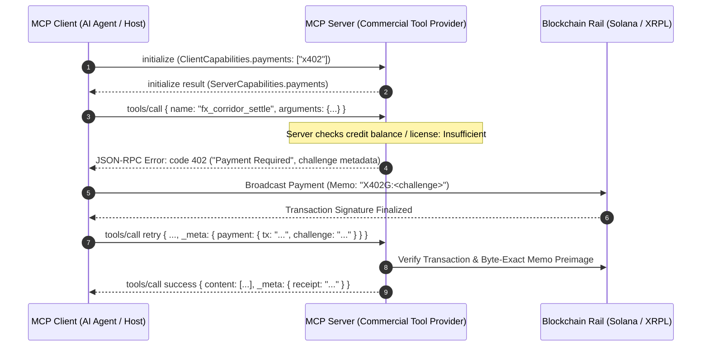

# MCP-402: Payment-Gated Tool Execution & Challenge Protocol Extension

```
Document:       MCP-RFC-0402
Title:          Payment-Gated Tool Execution & Challenge Protocol Extension (MCP-402)
Author:         Abdul Shabazz <veritasvaultone@gmail.com>
Organization:   Synaptics Lab
Status:         Proposed Specification / Extension RFC
Created:        2026-09-26
Related Specs:  IETF draft-shabazz-http-x402-tswp-00; Solana SIMD PR #671; Zenodo DOI 10.5281/zenodo.22979715
```

---

## 1. Abstract

This specification defines **MCP-402**, an open protocol extension to the **Model Context Protocol (MCP)** that introduces standardized capability negotiation, payment challenge error handling, and proof-of-settlement validation for machine-to-machine (M2M) tool execution. 

MCP-402 enables autonomous AI agents to discover priced tools, negotiate multi-rail micropayments (Solana, XRPL, HTTP 402), and execute commercial tool calls without relying on proprietary out-of-band subscription keys or centralized payment coordinators.

---

## 2. Motivation & Problem Statement

The Model Context Protocol currently standardizes JSON-RPC transport for Prompts, Resources, and Tools. However, as autonomous agents interact with external commercial services (e.g., proprietary financial data, institutional execution venues, high-cost computational simulators), the absence of a native payment negotiation standard creates critical friction:

1. **Out-of-Band Key Management:** Current MCP servers require manual operator intervention to generate and configure proprietary API keys, breaking autonomous agent workflows.
2. **Lack of In-Band Rate Metering:** Servers have no protocol-compliant mechanism to signal that a tool call requires micro-fee replenishment or per-call settlement.
3. **No Proof-of-Settlement Grammar:** Clients cannot provide verifiable cryptographic evidence that a specific invocation fee was satisfied on-chain.

MCP-402 resolves these deficiencies by embedding the IETF `X402-TSWP` typed wire protocol into the JSON-RPC lifecycle of MCP.

---

## 3. Protocol Lifecycle & Specification



### 3.1 Capability Negotiation (`initialize`)

During the `initialize` handshake, both client and server declare support for payment negotiation.

#### Client Initialization Request:
```json
{
  "jsonrpc": "2.0",
  "id": 1,
  "method": "initialize",
  "params": {
    "protocolVersion": "2024-11-05",
    "capabilities": {
      "roots": { "listChanged": true },
      "sampling": {},
      "payments": {
        "schemes": ["x402"],
        "supportedRails": ["solana-devnet", "solana-mainnet", "xrpl-altnet", "xrpl-mainnet"]
      }
    },
    "clientInfo": {
      "name": "SynapticTraderAgent",
      "version": "1.0.0"
    }
  }
}
```

#### Server Initialization Response:
```json
{
  "jsonrpc": "2.0",
  "id": 1,
  "result": {
    "protocolVersion": "2024-11-05",
    "capabilities": {
      "tools": { "listChanged": true },
      "payments": {
        "schemes": ["x402"],
        "memoGrammar": "X402G:<challenge>",
        "defaultCurrency": "drops"
      }
    },
    "serverInfo": {
      "name": "SynapticClearingGateway",
      "version": "1.0.0"
    }
  }
}
```

---

### 3.2 Tool Discovery with Pricing Metadata (`tools/list`)

Servers MAY expose pricing metadata on individual tools to allow autonomous agents to plan execution budgets:

```json
{
  "jsonrpc": "2.0",
  "id": 2,
  "result": {
    "tools": [
      {
        "name": "fx_corridor_settle",
        "description": "Executes atomic foreign exchange settlement on Solana Token-2022.",
        "inputSchema": {
          "type": "object",
          "properties": {
            "corridor": { "type": "string" },
            "gross": { "type": "number" }
          },
          "required": ["corridor", "gross"]
        },
        "pricing": {
          "scheme": "x402",
          "pricePerCall": "160",
          "unit": "drops",
          "supportedRails": ["solana-devnet", "xrpl-altnet"]
        }
      }
    ]
  }
}
```

---

### 3.3 The Payment Required Error Payload (Code `402`)

When a client invokes a tool requiring payment without sufficient pre-funded credits or session bonds, the server MUST return a standard JSON-RPC error with code `402`:

```json
{
  "jsonrpc": "2.0",
  "id": 3,
  "error": {
    "code": 402,
    "message": "Payment Required",
    "data": {
      "scheme": "x402",
      "challenge": "827da995-adda-4dd7-9fb5-d05338526873",
      "price": "160",
      "unit": "drops",
      "recipient": "rKmtCQXuZpXWgb7KiwKbiQwJeX6AtbpMtC",
      "memo": "X402G:827da995-adda-4dd7-9fb5-d05338526873",
      "expiresAt": 1789860818,
      "rails": [
        {
          "rail": "xrpl-altnet",
          "recipient": "rKmtCQXuZpXWgb7KiwKbiQwJeX6AtbpMtC",
          "amount": "160"
        },
        {
          "rail": "solana-devnet",
          "recipient": "BnuCTFWFLLXnSPv2Frs42royiTAYG87WP7p1zRLB4ksG",
          "amount": "1000",
          "unit": "lamports"
        }
      ]
    }
  }
}
```

---

### 3.4 Execution Retry with Payment Proof (`tools/call`)

The client executes the on-chain transfer attaching the exact `memo` payload, then replays the tool call attaching the proof in the standardized `_meta.payment` field:

```json
{
  "jsonrpc": "2.0",
  "id": 4,
  "method": "tools/call",
  "params": {
    "name": "fx_corridor_settle",
    "arguments": {
      "corridor": "USD/KES",
      "gross": 2500000
    },
    "_meta": {
      "payment": {
        "scheme": "x402",
        "rail": "solana-devnet",
        "tx": "5wK1S...7vL",
        "challenge": "827da995-adda-4dd7-9fb5-d05338526873"
      }
    }
  }
}
```

---

### 3.5 Successful Execution Response with Receipt

Upon validating that the on-chain transaction succeeded, delivered the required amount, and carried the byte-exact challenge memo, the server returns the tool execution result along with an immutable settlement receipt:

```json
{
  "jsonrpc": "2.0",
  "id": 4,
  "result": {
    "content": [
      {
        "type": "text",
        "text": "Settlement of $2,500,000 USD/KES committed on Solana Devnet. Tx: 4uQ7T...8kL"
      }
    ],
    "_meta": {
      "receipt": {
        "scheme": "x402",
        "rail": "solana-devnet",
        "leaf": "a161f58503615516e4a7aa678f19a7dc67ab6ef76b236f2d712a54ed80a6d331",
        "creditsRemaining": 85
      }
    }
  }
}
```

---

## 4. Security & Anti-Abuse Invariants

1. **Non-Fungible Nonces:** Every challenge token MUST be a cryptographically random RFC 4122 UUIDv4 token. Once settled, the server transitions the token to `Settled` or `Expired`, completely eliminating transaction replay.
2. **Byte-Exact Memo Verification:** On-chain verification MUST enforce strict equality (`memo == "X402G:" + challenge`) to prevent trailing character injection.
3. **Session Bonding (`X402B`):** For high-frequency tool calls, servers MAY allow clients to lock a single bond and deduct micro-fees monotonically using sequential counters (`call_seq`), avoiding on-chain latency on every call.

---

## 5. Reference Implementation & Standards Alignment

- **Production Gateway:** Deployed on `:8405` (`mcp-402-gateway` / `syn-m2m-server`).
- **IETF Specification:** Published under IETF Datatracker [`draft-shabazz-http-x402-tswp-00`](https://datatracker.ietf.org/doc/draft-shabazz-http-x402-tswp/).
- **Solana Foundation SIMD:** Proposed as [`Solana SIMD PR #671`](https://github.com/solana-foundation/solana-improvement-documents/pull/671).
- **Defensive Prior Art:** Registered under [Zenodo DOI `10.5281/zenodo.22979715`](https://doi.org/10.5281/zenodo.22979715).
